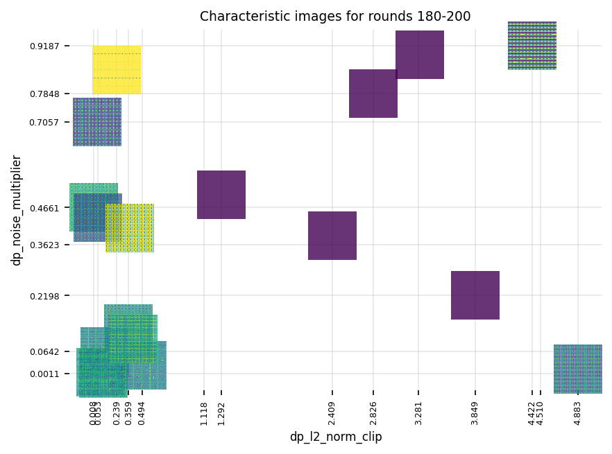
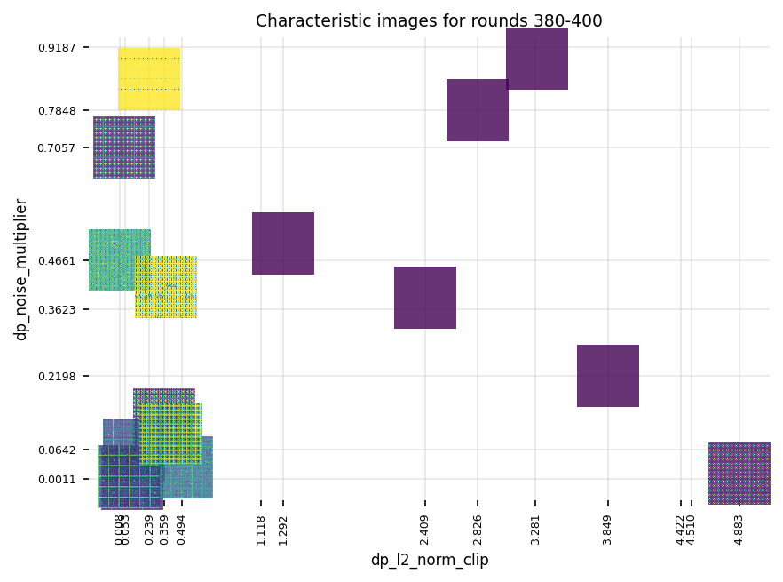
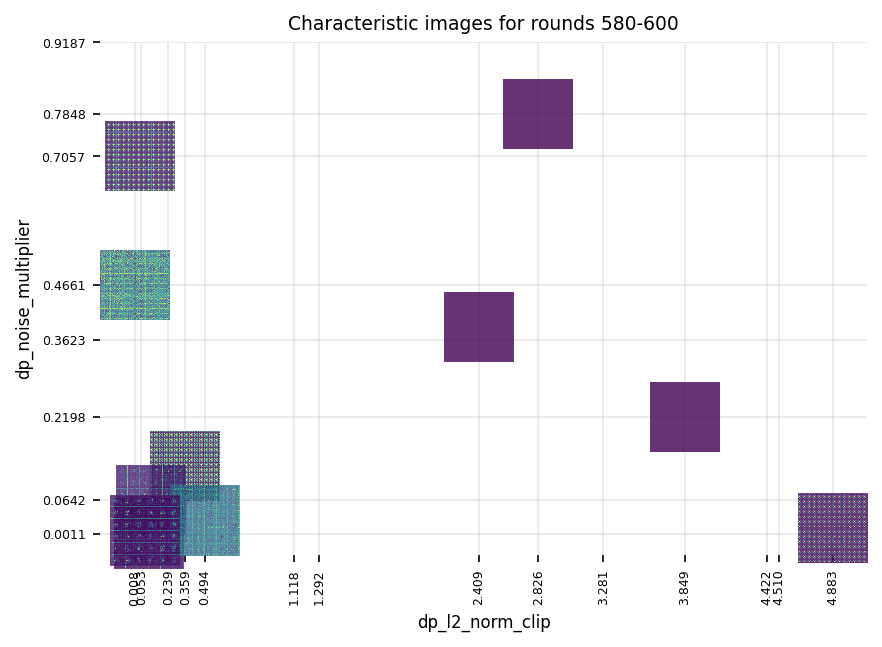
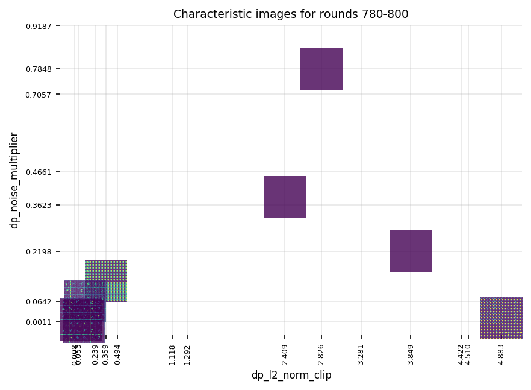
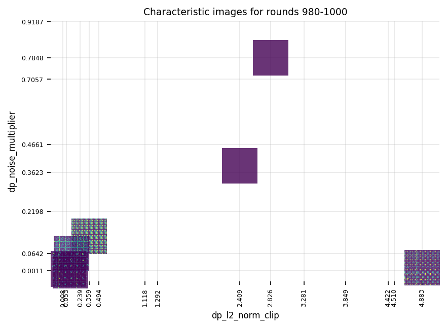

# Federated Triplet Loss

## Demos

### Ablation for differentially private federated GAN

See [this notebook](./demos/federated-gan-training-loop.ipynb) used for training the federated GAN.

See [this notebook](./demos/ablation-results.ipynb) to reproduce the visualizations below.

#### Round 200

#### Round 400

#### Round 600

#### Round 800

#### Round 1000

