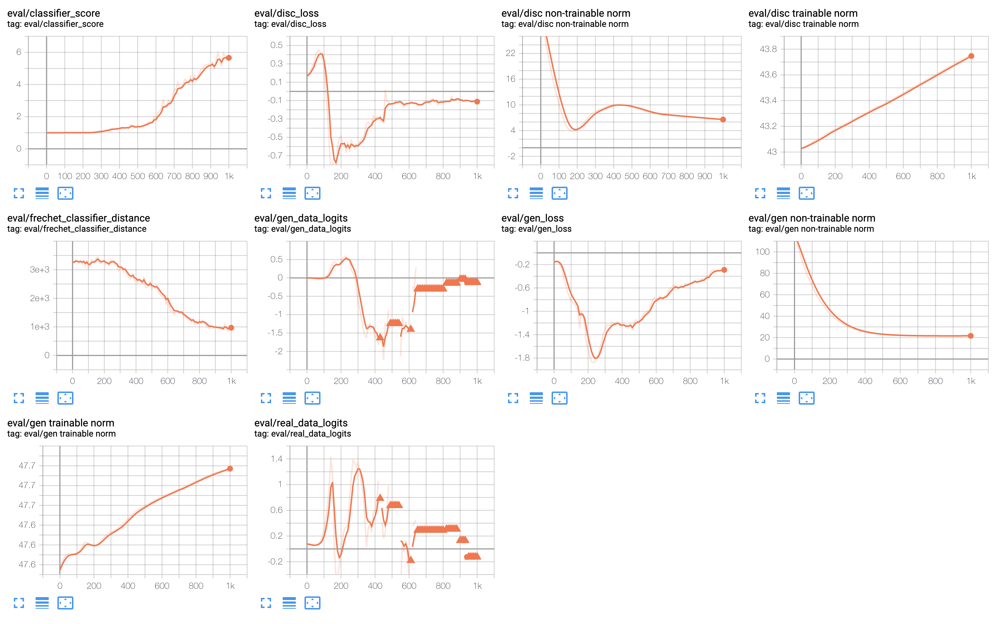

# Federated Triplet Loss

Paper: _Augenstein, Sean, H. Brendan McMahan, Daniel Ramage, Swaroop Ramaswamy, Peter Kairouz, Mingqing Chen, Rajiv Mathews, and Blaise Aguera y Arcas_. 2019. [“Generative Models for Effective ML on Private, Decentralized Datasets”](https://arxiv.org/abs/1911.06679)

## Demos

### Ablation for differentially private federated GAN

- [`./demos/federated-gan-training-loop.ipynb`](./demos/federated-gan-training-loop.ipynb): training a federated GAN on Colab
- [`./demos/ablation-results.ipynb`](./demos/ablation-results.ipynb): visualizing the runs

#### Examples of successful convergence after 1000 rounds

- `dp_l2_norm_clip`: **0.1**, `dp_noise_multiplier`: **0.01**

  - **Sample**:

    

  - **Log**:

    

- `dp_l2_norm_clip`: **0.08036**, `dp_noise_multiplier`: **0.00555**

  - **Sample**:

    

  - **Log**:

    

- `dp_l2_norm_clip`: **0.105667**, `dp_noise_multiplier`: **0.001130**

  - **Sample**

    

  - **Log**

    

#### Examples of unsuccessful convergence after 1000 rounds

- `dp_l2_norm_clip`: **0.119396**, `dp_noise_multiplier`: **0.064232**

  - **Sample**

    

  - **Log**

    

- `dp_l2_norm_clip`: **2.408976**, `dp_noise_multiplier`: **0.386463**

  - **Sample**

    

    The model diverged early in the process:

    - Round 120

      

    - Round 130

      

  - **Log**

    
